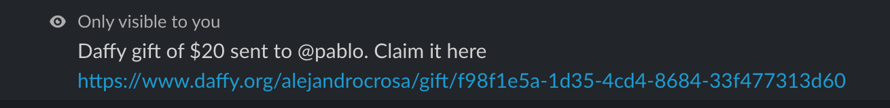
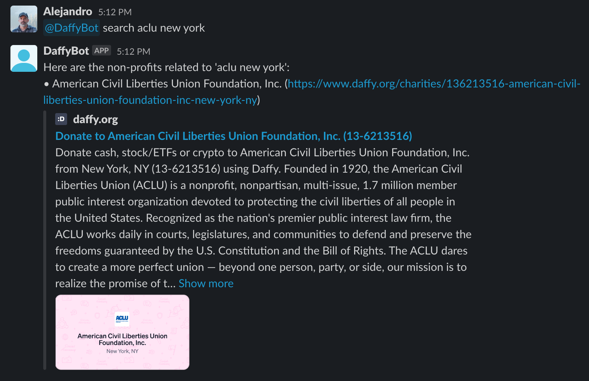

# Daffy Slack Bot example

This is a sample Slack bot demonstrating the Daffy API. It allows authorized users to send Daffy gifts to other users and search for non-profit organizations. This version of the bot uses Socket Mode to communicate with Slack.

## Prerequisites

1. Node.js (v14.0 or higher)
2. NPM (v6.0 or higher)
3. A Slack workspace with admin access

## Setup

### Slack App Configuration

1. Visit the [Slack API website](https://api.slack.com/apps) and sign in to your Slack workspace.
2. Click on "Create New App", provide an App name (e.g., "Daffy") and choose the workspace you want to develop the bot for, then click "Create App".
3. In the "Socket Mode" section, enable Socket Mode and generate an "App Token". Save this token for later use.
4. In the "Add features and functionality" section, click on "Slash Commands" and click on "Create New Command". Create the `/daffy` command with a short description. Save the command.
5. In the "Add features and functionality" section, click on "Event Subscriptions". Enable "Events" and then subscribe to the `app_mention` event by clicking "Add Bot User Event" and searching for "app_mention". Save the changes.
6. In the "OAuth & Permissions" section, add the following scopes under "Bot Token Scopes":
   - `app_mentions:read`
   - `chat:write`
   - `commands`
7. Click "Install App" in the sidebar and install the app to your workspace. You'll receive a `Bot User OAuth Token`. Save this on your .env variables under `SLACK_BOT_TOKEN` (see below).

### Running the Sample Code

1. Clone the repository and navigate to the project folder.
2. Install the dependencies with `npm install`.
3. Create a `.env` file in the project folder with the following variables:

   ```
   DAFFY_API_KEY=<your_daffy_api_key>
   SLACK_USERS_ALLOWED_TO_MANAGE_DAFFY_FUND=<comma_separated_slack_usernames>
   SLACK_BOT_TOKEN=<your_bot_user_oauth_token>
   SLACK_APP_TOKEN=<your_socket_mode_app_token>
   ```

   `DAFFY_API_KEY` obtain the Daffy API key for your Fund here https://www.daffy.org/settings/api

   `SLACK_USERS_ALLOWED_TO_MANAGE_DAFFY_FUND` are the users who can manage the fund and can perform actions like sending Gifts to users.

   `SLACK_BOT_TOKEN` & `SLACK_APP_TOKEN` can be obtained by following the steps described in "Slack App Configuration".

4. Replace the placeholders with the corresponding values obtained during the Slack App configuration.
5. Run the bot using `npm start` or `node index.js`.

Now your Daffy Slack bot with Socket Mode enabled is up and running! To use the bot, invite it to any channel in your workspace and use the `/daffy` slash command or mention the bot using `@Daffy` followed by a command. 🎉





If you have any questions feel free to reach out to us.
